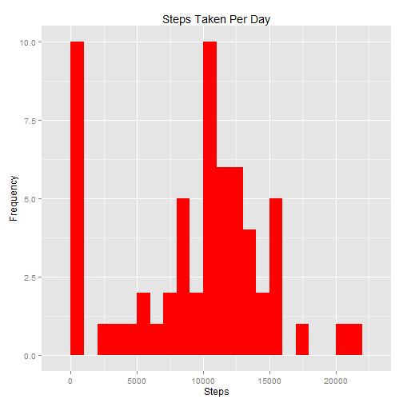
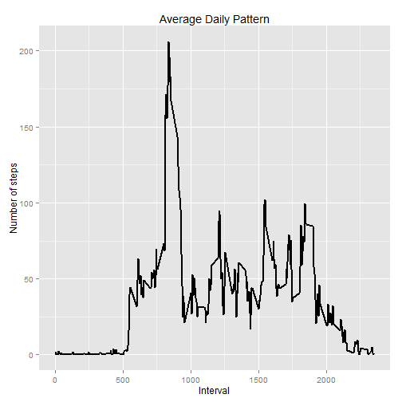
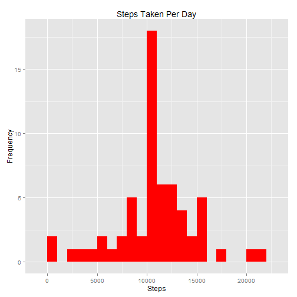
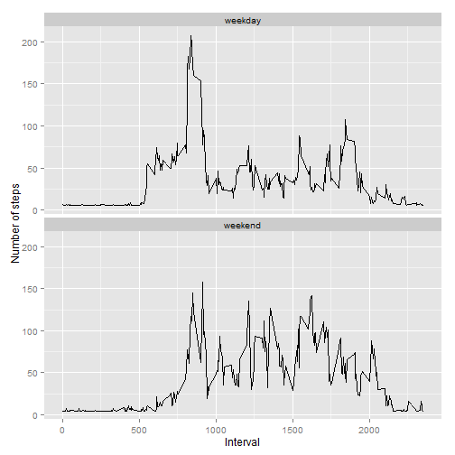

##RepData_PeerAssessment1


Download Library


```r
library(ggplot2)
library(knitr)
```

##1. Loading and preprocessing the data
1.1 Show any code that is needed to load the data


```r
setwd("~/Redproducible Research/RData/redata_data_activity")
ActivityData <- read.csv("activity.csv")
```


Verify the dataset structure:


```r
str(ActivityData)
```

```
## 'data.frame':	17568 obs. of  3 variables:
##  $ steps   : int  NA NA NA NA NA NA NA NA NA NA ...
##  $ date    : Factor w/ 61 levels "2012-10-01","2012-10-02",..: 1 1 1 1 1 1 1 1 1 1 ...
##  $ interval: int  0 5 10 15 20 25 30 35 40 45 ...
```

The Variables in the data are as follows:
- steps: Number of steps taking in a 5-minute interval (missing values are coded as NA)
- date: The date on which the measurement was taken in YYYY-MM-DD format
- interval: Identifier for the 5-minute interval in which measurement was taken

The dataset is stored in a comma-separated-value (CSV) file and there are a total of 17,568 observations in this dataset.

1.2 The date column is factor and needs to be tranformed to a date field


```r
ActivityData$date <-as.Date(ActivityData$date,format = "%Y-%m-%d")
```

Looking at the data we can see that there are several NA values that we should exclude when finding the mean and median values of the dataset


```r
sum(is.na(ActivityData$steps))
```

```
## [1] 2304
```

##2. What is mean total number of steps taken per day?
The total steps per day is calcuated below as well as visual representation in a histogram


```r
sumstepsperday <- aggregate(ActivityData$steps, by = list(ActivityData$date), FUN = sum, na.rm = TRUE)
colnames(sumstepsperday) <- c("date", "steps")
ggplot(sumstepsperday, aes(x = steps)) + geom_histogram(fill = "red", bin = 1000) + labs(title = "Steps Taken Per Day", x = "Steps", y = "Frequency")
```

 

2.2 Calculate and report the mean and median total number of steps taken per day

The mean and median of the steps per day are as follows:


```r
mean(sumstepsperday$steps)
```

```
## [1] 9354.23
```

```r
median(sumstepsperday$steps)
```

```
## [1] 10395
```

##3. What is the average daily activity pattern?
To find the daily, average pattern we find the mean of each interval and graph the results.


```r
dailyAvg <- aggregate(ActivityData$steps, by = list(ActivityData$interval), FUN=mean, na.rm = TRUE)
colnames(dailyAvg) = c("interval", "steps")

ggplot(dailyAvg, aes(x=interval, y=steps)) + geom_line(color = "black", size = 1) + labs(title="Average Daily Pattern", x="Interval", y="Number of steps")
```

 

The max 5-minute interval in the average can be found using the following:


```r
dailyAvg$interval[which.max(dailyAvg$steps)]
```

```
## [1] 835
```

What we find is the 835th interval containing the max number of steps

##4. Imputing missing values

4.1 Calculate and report the total number of missing values in the dataset (i.e. the total number of rows with NAs)

The number of NA values was calculated above using:


```r
sum(is.na(ActivityData$steps))
```

```
## [1] 2304
```


To input the missing values I choose to use to loop and apply it to the entries with missing values. 


```r
ActivityDataModified <- ActivityData
for (i in which(sapply(ActivityDataModified, is.numeric))) {
  ActivityDataModified[is.na(ActivityDataModified[, i]), i] <- mean(ActivityDataModified[, i],  na.rm = TRUE)
  }
```


We use a histogram like earlier to aggregate and graph the dataset


```r
Stepsperdaymodified <- aggregate(ActivityDataModified$steps, by = list(ActivityDataModified$date), FUN=sum, na.rm=TRUE)
colnames(Stepsperdaymodified) <- c("date","steps")

ggplot(Stepsperdaymodified, aes(x = steps)) + geom_histogram(fill = "red", binwidth = 1000) + labs(title = "Steps Taken Per Day", x = "Steps", y = "Frequency")
```

 

Calculating the mean and median as above


```r
mean(Stepsperdaymodified$steps)
```

```
## [1] 10766.19
```

```r
median(Stepsperdaymodified$steps)
```

```
## [1] 10766.19
```

Inputting data into the missing values makes a difference with the mean changing from 9354.23 to 10766.19 and the median changing from 10395 to 10766.19.


##5. Are there differences in activity patterns between weekdays and weekends?

To find the different activity levels by weekday or weekend we can use the following:


```r
ActivityDataModified$dayType <-  ifelse(as.POSIXlt(ActivityDataModified$date)$wday %in% c(0,6), 'weekend', 'weekday')
```

Then we can graph the results in a panel plot as so:


```r
ActivityDataModified <- aggregate(steps ~ interval + dayType, data=ActivityDataModified, mean)
ggplot(ActivityDataModified, aes(x=interval, y=steps)) + 
        geom_line(color="black") + 
        facet_wrap(~ dayType, nrow=2, ncol=1) +
        labs(x="Interval", y="Number of steps")
```

 
